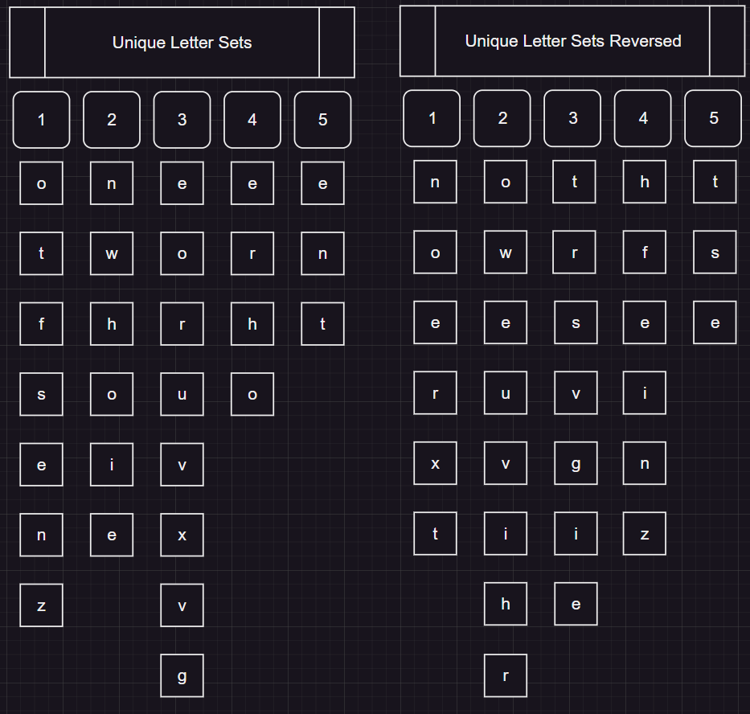

#  

## Day 1

"Elves have forgotten their encryption key! You need to find the first and last number in each line then sum the total"
The catch is the numbers can be as "one" or "1" and I thought why not try and do it in a linear fashion.


### Initialisation

#### Could I do this O(N)

Essentially these are all the terms that I'll have to try and find in the jumbled mess that is the input file.Considering you need to find the first and the last number, why not just search from the back once you've found the first.
I thought would be as simple as reversing the intitial list but due to the mismatch of repeating characters the sets turn out different.

| |  |   |
|----------------------------------------------------|---------------------------------------------------------------|---|

#### SETS



This is what you're left with when you remove the duplicates

And there you have it.
 
```rust
let string_list:Vec<&str>  = vec![
        "zero",        "one",        "two",        "three",        "four",
        "five",        "six",        "seven",        "eight",        "nine",
    ];

    let mut building_int: HashMap<u8, Vec<char>> = HashMap::new();
    let mut rev_building_init: HashMap<u8, Vec<char>> = HashMap::new();

    let mut unique_letters: HashMap<u8, HashSet<char>> = HashMap::new(); 
    let mut rev_unique_letters: HashMap<u8, HashSet<char>> = HashMap::new(); 
    

    init_int_builder(&string_list,&mut building_int);
    rev_init_int_builder(&string_list,&mut rev_building_init);

    saturate_unique_word_hashset(&string_list,&mut unique_letters);
    rev_saturate_unique_word_hashset(&string_list,&mut rev_unique_letters);


    dbg!(unique_letters);
    dbg!(rev_unique_letters);
```

Appologise for md's rust highlighting but thats the initialisation done.
